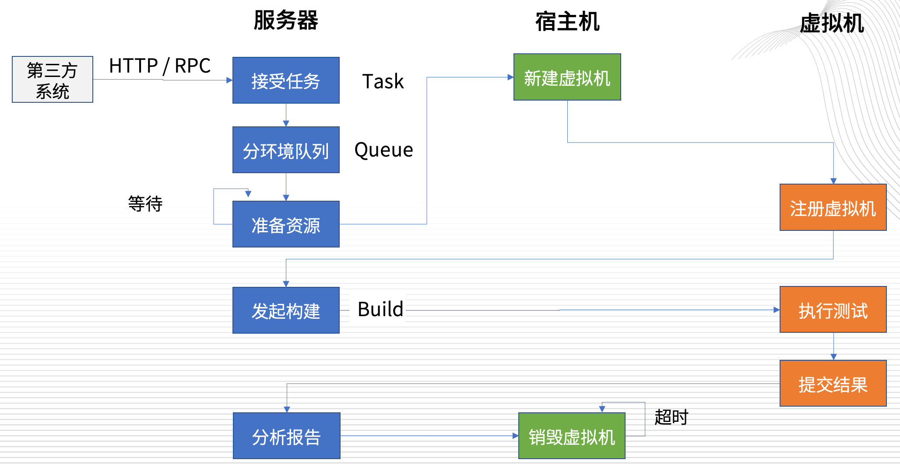

## ZAgent简介

### 什么是ZAgent

ZAgent是禅道开源的测试调度平台，它使用虚拟化技术，提供了一个集中、分布式、按需创建、用后即焚的的测试环境，从而提高测试执行效率，减少测试资产投入。

## 为什么需要ZAgent

随着敏捷、DevOps和CI/CD等研发过程和实践的广泛应用，软件测试、特别是自动化测试面临了越来越大的机遇和挑战。自动化测试作为流水线的构建、部署、验证、发布过程中的一个不可忽视的环节，其能否高效运行，同测试环境的有效管理是密不可分的。

## ZAgent支持哪些虚拟化平台

ZAgent目前支持KVM-QEMU、Docker、VirtualBox、VmWare、阿里云、华为云几种流行的虚拟机和容器平台。

## ZAgent是如何工作的

1. 宿主机（Host）上运行的ZAgent代理，每隔段时间会向服务器发送心跳请求，注册其状态；
2. 第三方系统向服务器发送自动化测试请求；
3. 服务器保存测试任务（Task），并将其按环境拆解成测试队列（Queue）；
4. 服务器按队列的环境，检索具备该能力的虚拟机模板（Vm Template）；
5. 根据找到的虚拟机模板，查找存在该模板的宿主机；
6. 服务器检测到宿主机空闲时，向其发送创建虚拟机的请求；
7. 宿主机接到请求，负责按虚拟机模板和基础镜像（Vm Backing File）创建虚机；
8. 虚拟机创建成功后，会自动运行ZAgent代理，向服务器注册其状态；
9. 服务器收到虚拟机就绪的请求后，新建一个测试构建（Build）；
10. 服务器向虚拟机发送测试构建的执行请求；
11. 虚拟机将测试构建请求保存到其队列中，等待空闲时开始执行；
12. 虚拟机完成测试构建，打包并上传指定的文件，向服务器发送测试结果；
13. 服务器收到测试结果，更新构建、乃至其队列和任务的状态；
14. 服务器分析测试结果，形成统计报告用于展示。

# ZAgent指南

## [安装部署](deploy/index)

## [服务集成](integration/index)

## [API手册](api/index)
