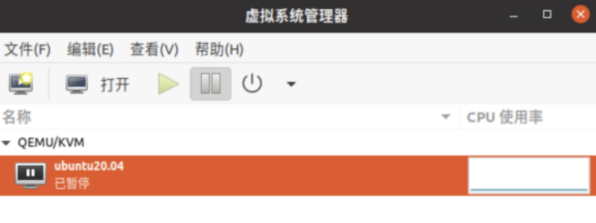
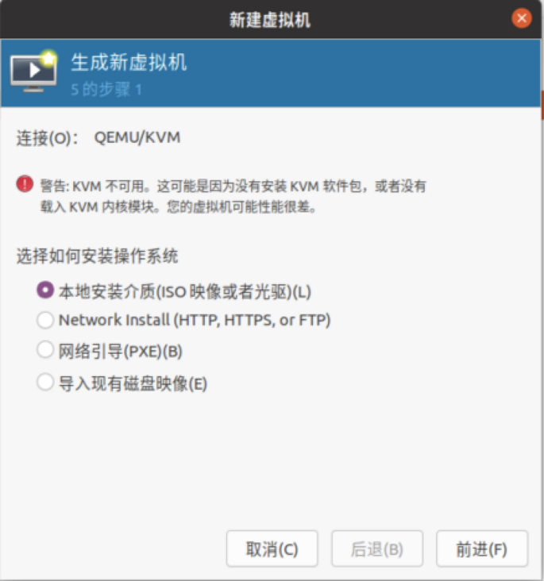
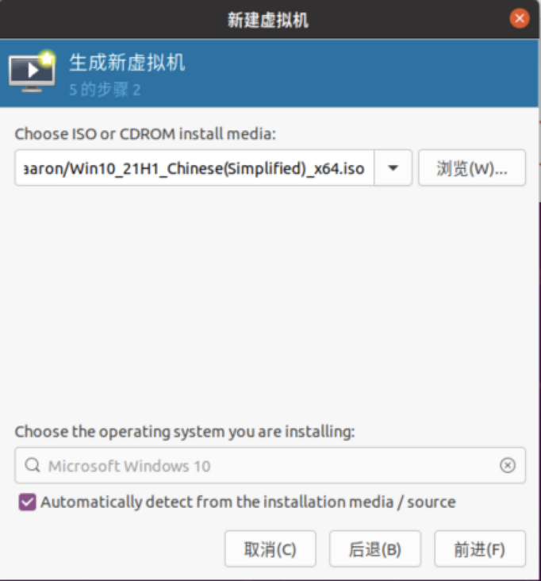
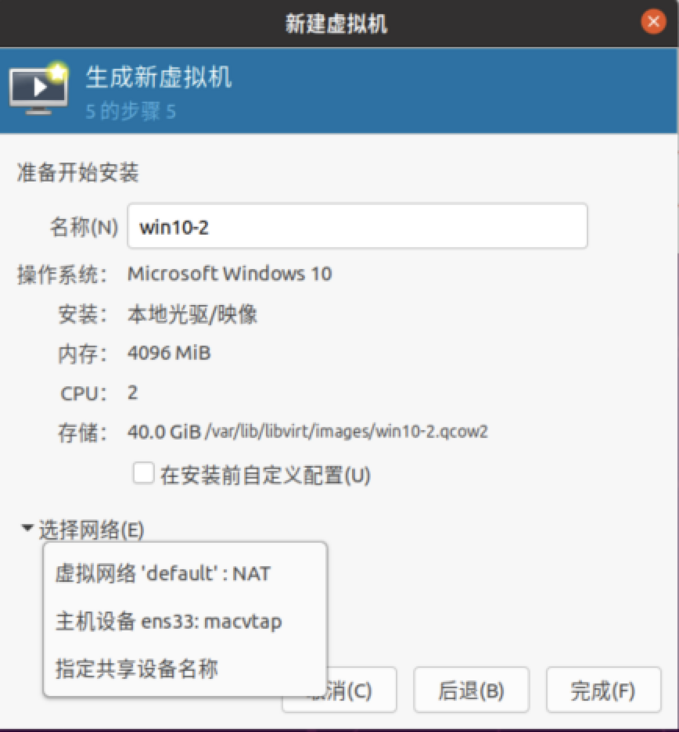
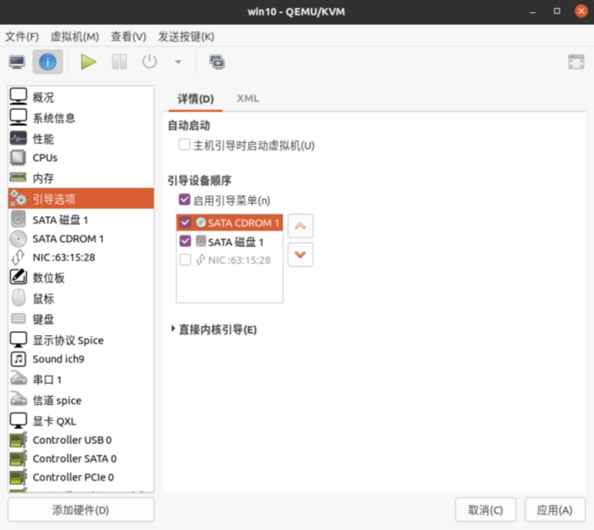
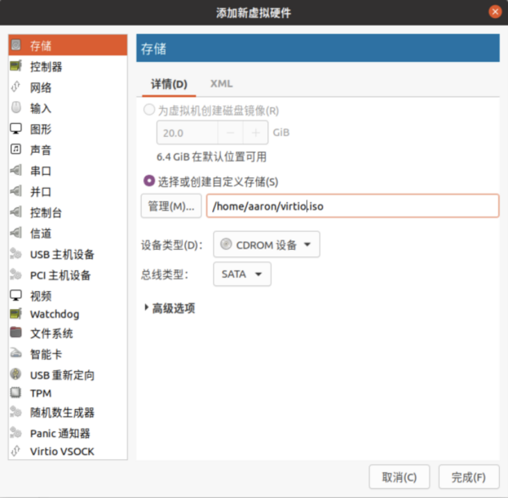
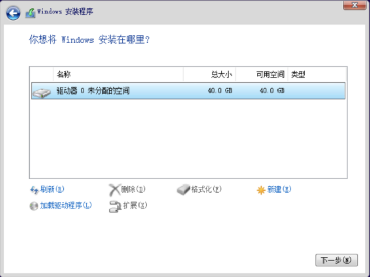
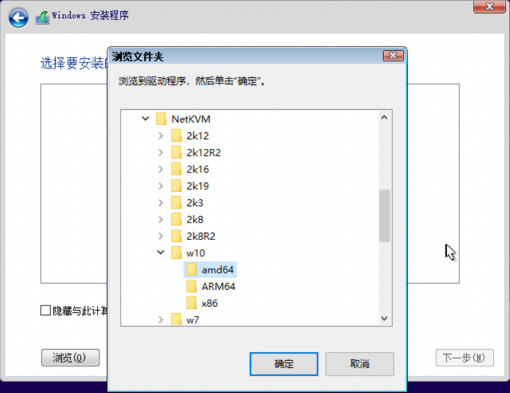

# 部署KVM宿主机环境

这里使用Ubuntu20.04桌面版来作为宿主机，搭建虚拟化环境。

##### 1. 首先，验证主机是支持虚拟化，有输出表明支持

```autoit
root@pve:~# egrep -o "(vmx|svm)" /proc/cpuinfo
vmx
vmx
vmx
```

##### 2. 安装虚拟化软件

```maxima
sudo apt-get install qemu-kvm libvirt-daemon-system libvirt-clients qemu virt-manager bridge-utils
sudo service libvirtd restart
```

老的Ubuntu系统，请用以下命令替换。注意libvirt-daemon-system、libvirt-clients换成libvirt-bin。

```mipsasm
sudo apt-get install qemu-kvm libvirt-bin qemu virt-manager bridge-utils 
sudo service libvirt-bin 
restart
```

##### 3. 下载系统和驱动

- 从 [这里](https://link.segmentfault.com/?enc=o6bhLNaZX7kVgMR1g2vZ5Q%3D%3D.Lm0bgay84laLYEcH8pnEmNyT5oU5ehNJGP1mV8jZ8OsbzSQQVY2VF3tXHK9%2Fkcb7EXrtUTajHlDL7LZr%2FvbEbQ%3D%3D)下载微软Win10官方光盘镜像；
- 在 [这里](https://link.segmentfault.com/?enc=ZBXaRQnrXcXd6NKLwtZKrQ%3D%3D.AzfQjb2yLi4CPa%2BexpLiXFWrAxwAFOjUtY7ICQ4WuUwPoLFL%2Fq2mIzcUHjLNuQYHaZ68NfTohZtqoSGANcjCrI1gZQWbCwmTFXqI46aF40g%3D)下载虚机I/O设备驱动，我选择的是稳定版virtio-win-0.1.185.iso。

##### 4. 打开虚拟机管理工具

在图形界面中打开终端，输入virt-manager，启动虚拟机管理工具；


- 图中显示的QEMU/KVM表明，已成功连接到本地服务；
- 如果状态为断开，请双击尝试连接，若显示不能连接到libvirtd服务，可重启机器修复；
- 您也可以通过点击菜单“文件->添加连接”，来连接和管理远程宿主机上的虚拟机，格式形如qemu+ssh://user@192.168.0.56:22/system?socket=/var/run/libvirt/libvirt-sock。

##### 5. 新建虚拟机

- 点击菜单“文件->新建虚拟机”，打开虚拟机创建向导；
  
- 选择前面下载的Win10镜像文件作为本地安装介质；
  
- 网络设置页面，选择“主机设备”也就是宿主机的网卡，这样虚拟机会作为局域网中的一台电脑而存在；
  
- 按向导完成其他设置，并保存。

##### 6. 设置虚拟机

- 双击打开虚拟机窗口，点击”查看->详情“，进入虚拟机属性页面；
- 点击引导选项卡，设置系统从光盘启动；
  
- 点击左下角”添加硬件”，增加一个光盘，指向下载的virtio驱动；
  

##### 7. 安装虚拟机

- 启动后，自动从光盘安装系统；
- Windows安装向导中，选择加载驱动程序；
  
- 选择virtio驱动CDROM里，NetKVM目录下对应系统的文件；
  
- 完成后续的安装步骤。

##### 8. 结束安装

- 安装完成后，再次打开虚拟机窗口；
  
- 进入CDROM选项卡，删除安装光盘；
- 启动虚拟机，更新系统，并安装测试相关软件；
- 完成后续的安装步骤。